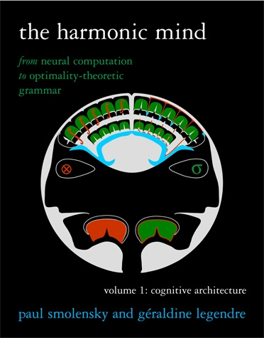
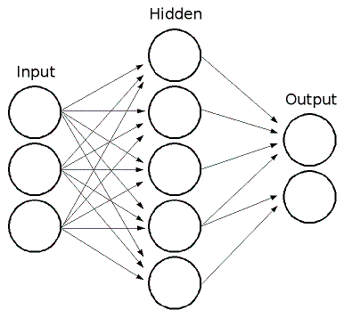

# Motivation

## What are we trying to do here?

## Representation and levels of analysis

- Marr's levels
    - Computation (function): What problem is being solved?
    - Algorithm: How is that problem solved?
    - Implementation: How is that solution physically instantiated?
- We need theories at all three.

## Bridging levels of analysis
- Top-down [@griffiths10]
    - Start from what we know best: behavior.
    - Models are constrained by their representations.
- Bottom-up [@mcclelland10a]
    - Informed by behavior _and_ neuroscience.
    - Models are constrained by their mechanisms.
<!-- computer programming metaphor -->

## The appeal of domain-general representation
- Parsimony
- Systematicity
- Feasibility

# Vector Symbolic Architectur  es

## A bridge from neurons to symbols
\ 

## Distributed representation
- "The deepest philosophical commitment of the connectionist endeavor." [@chalmers90]
- A single entity is represented by many units, each of which may have little to no individual meaning.
- Computation with linear algebra.
- Widely believed to be characteristic of neural processing. (There is no grandmother neuron!)

## Neural networks
\ 

## Neural networks

### Challenges
- Empirical
    - Working memory vs. long-term memory.
    - Rapid, one-trial learning.
    - Self-generated knowledge.

. . .

- Theoretical
    - Algorithmic explanation.
    - Large-scale cognitive architecture.
    <!-- Can we combine models of different areas into a cohesive picture -->

## Computation in VSAs
- Defined with algebraic operators _at the algorithmic level._
    - Contrast to networks, which can be viewed as a single operator
- Symbolic control, distributed computation.
- Modular and composable.
- Functionally transparent.

## Computation in VSAs

### Fundamental VSA operations [@gayler04]
- _Addition-like_ superposes vectors or adds them to a set.
- _Multiplication-like_ associates or binds vectors.
- _Permutation-like_ quotes or protects vectors from other operations.

. . .

### Fundamental VSA operations (functional)
- _bundle_ aggregates vectors into a flat, set-like representation.
    - Concept, or semantic pointers [@eliasmith13]
- _label_ tags a content vector with a variable/role vector.
    - Syntactic dependencies [@basile11]
- _merge_ composes two or more vectors into a structured, tree-like representation.
    - N-grams [@jones07]


## Neural realism
- Convolution can be implemented in a back-propagation network [@plate95].
- Neural Engineering Framework compiles simple VSA algorithms into a spiking network [@eliasmith03].

. . .

- _But_, it's an open question whether more complex models will have a clear neural implementation.
    - How is control implemented?
    - How are algorithms learned?
- The _possibility_ of a neural implementation does not imply biological reality.

# VectorGraph

## VectorGraph
- A directed, weighted multigraph.
- Pseudo-probabilistic edges.
- Represents a node and its edges with a high dimensional vector.

## Distributional semantic models
- Approximate the meaning of a word by the contexts in which it occurs.
- A massive matrix with a row for each word and a column for each context.
- Dimensionality reduction (e.g. Singular Value Decomposition) compresses the dimensionality of the rows.

## Random indexing for DSMs [@kanerva00]
- Online dimensionality reduction of a word-context matrix.
- _Index vector_ represents a context.
    - An immutable, $D$ dimensional, sparse vector.
- _Context vector_ represents a word.
    - A mutable, $D$ dimensional vector.
    - Initialized to $\bm{0}$.
    - The sum of index vectors for the contexts in which the word occurs.

## Random indexing __for graphs__
- Online dimensionality reduction of __an adjacency matrix.__
- ___Index vector___ represents __an edge to a node.__
    - An immutable, $D$ dimensional, sparse vector.
- ___Row vector___ represents __all outgoing edges of a node.__
    - A mutable, $D$ dimensional vector.
    - Initialized to $\bm{0}$.
    - The sum of index vectors for __the nodes that this node points to.__

## VectorGraph operations

```include
operations.md
```

## Generalization
- Essential for knowledge to be useful in an ever-changing world.

### Two definitions
- __Behaviorist__: Responding the same way to different but similar stimuli.
- __Cognitivist__: Enriching the representation of an item based on similarities to previously encountered items.

## Theoretical approaches to generalization

### Categorical
- Generalization is mediated by discrete category labels.
    - A category is a probability density function over the feature space [@ashby95].
- Three step process:
    1. \ Identify relevant category for the novel stimulus.
    2. \ Apply known features of that category to the novel stimulus.
    3. \ Respond to the stimulus based on the enriched representation.
- Often, only the first step is modeled.

## Theoretical approaches to generalization

### Connectionist
- Higher order patterns among features are learned directly.
    - Generalization is embedded in the hidden weights, inseparable from the rest of processing.
- One step process:
    1. \ Provide the network with an input representation; the resulting output is the response.


## An intermediate approach for the VectorGraph
- Generalization is a function mapping a raw row vector to a generalized row vector.

$$ \text{gen}(\row_x) = \sum_{n \in G} \row_n \simil(x, n) $$

- The vector simply becomes more similar to vectors it is already similar to.
- Can be also be done online, altering the row vector itself.
    - A clustering algorithm?


## Compositionality

### Traditional "Fregean" definition
- The meaning of an expression is a _function_ of the meaning of its constituent expressions and the _rules_ for combining them.
- A formal property of formal systems.

### An alternative conceptualization
- The properties of an item can be _inferred_ based on properties of its components and _statistical patterns_ in the relationships between wholes and parts.
- A cognitive tool.

<!-- What is the relation between these two concepts? -->

## Approaches to compositionality in vector space
- Complex merge functions.
    - Each function works in one domain?
- Labeling constituents.
    - Syntactic categories
- Build compositionality into the items themselves.


## Approximating phrase structure rules

- $\n{NP} \rightarrow \n{D} \    \n{N}$
- $\n{A} \sim \n{D} \wedge \n{B} \sim \n{N} \Rightarrow \n{[A B]} \sim \n{[D N]}$
- Replace $D$ with a distribution over all nodes.

$$ \row_{ab} = \sum_{xy \in G} \row_{xy} \sqrt{\simil(a, b) \simil(x, y)} $$ 


## Simulation 1: Generalization
- Can a bigram model use our generalization algorithm to capture syntactic categories?
- Construct a corpus that holds out two determiner-noun pairs.
    - Combination of two slightly different phrase structure grammars.
    - Critical pairs: _my table_ and _that bunny_
    - With generalization, these pairs should have non-zero edge weight.

## Simulation 1: Generalization
```
S    -> NP VP    |    S    -> NP VP
VP   -> V NP     |    VP   -> V NP 
VP   -> V        |    VP   -> V    
NP   -> Det N    |    NP   -> Det N
NP   -> Name     |    NP   -> Name 
V    -> saw      |    V    -> saw  
V    -> ate      |    V    -> ate  
N    -> boy      |    N    -> boy  
N    -> THAT     |    N    -> MY        *
Name -> Jack     |    Name -> Jack 
Name -> Bob      |    Name -> Bob  
Det  -> the      |    Det  -> the  
Det  -> TABLE    |    Det  -> BUNNY     *
```

## Simulation 1: Generalization

\ 

## Simulation 2: Compositionality
- Can a bigram model use our composition algorithm to infer the structural role of a novel noun phrase?
- Using the previous model, construct new nodes representing all noun-determiner pairs, holding out _the_ and _boy_.
    - For each of thes nodes, assign high edge weights to the verbs _saw_ and _ate_.
    - Construct the novel noun phrase _the boy_.
    - With compositionality, this new node should have high weights to _saw_ and _ate_.

## Simulation 2: Compositionality

\ 

# Nümila

## Nümila
- A simple graphical chunking model inspired by ADIOS [@solan05], U-MILA [@kolodny15], and CBL [@mccauley14a].
- Represents knowledge with a VectorGraph.
- Learning, parsing, and production are highly incremental algorithms that operate on this graph.
- Presented here to illustrate the use of a VectorGraph in a full-fledged cognitive model.

<!-- viscious, mean-spirited rumors -->


## Graphical model
- Directed, labeled multigraph.
- Words and phrases (_chunks_) as nodes.
- Forward and backward transitional pseudo-probabilities as edges.

-------

\ 


## Parsing
- Constructs a path through the graph, spanning the utterance.
- Operates within a four-node working memory window.
    - Could be more than four words if some nodes are chunks.
- Learning and parsing occur simultaneously.
    - Edge weights are increased between adjacent nodes.
    - Newly discovered words or chunks are added to the graph.

$$ \text{chunkiness}(a, b) = \sqrt{
    w_{\n{FTP}} \weight(a, b, \n{FTP}) \ 
    w_{\n{BTP}} \weight(b, a, \n{BTP}) } $$

## Parsing 
### Pseudo pseudocode
#. Add the next word in the utterance, $w_0$, to the path.
#. Bump weights.
    #. $\bump(w_{-1}, w_0, \n{FTP})$
    #. $\bump(w_0, w_{-1}, \n{BTP})$
#. Consider making a chunk.
    #. Measure chunkiness for all adjacent pairs in the graph.
    #. __If__ the best pair exceeds a fixed threshold:
        #. Replace the pair with their chunk.
        #. Bump weights to adjacent nodes.
    #. __Else__:
        #. Drop the least recent node to maintain four-node working memory.
        <!-- Only dropped from memory! -->

## Production
- Modeled as ordering a bag of words.
    - An attempt to isolate syntax from semantics.
- Chunks are greedily created from the bag.
- Beginning with the boundary unit, iteratively append the node having the highest chunkiness with the previous word.


## Simulation 1: Grammaticality discrimination
- Can the model distinguish adult utterances from neighbor-swapped versions?
    - "the dog ate steak" vs. "the ate dog steak"
- Grammaticality score is the product of chunkinesses between each node in the path.
- ROC: Receiver operator characteristic.

## Simulation 1: Grammaticality discrimination
\ 

## Simulation 2: Production
- Can the model put the words of an unseen adult utterance into the correct order?
- BLEU: Bilingual evaluation understudy.

## Simulation 2: Production

\ 

## Simulation 2: Production

\ 


